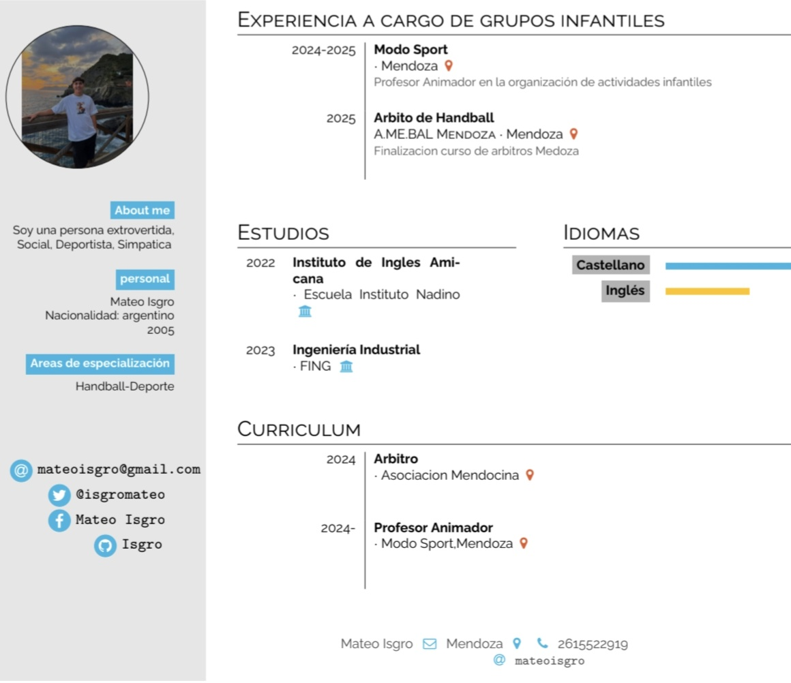
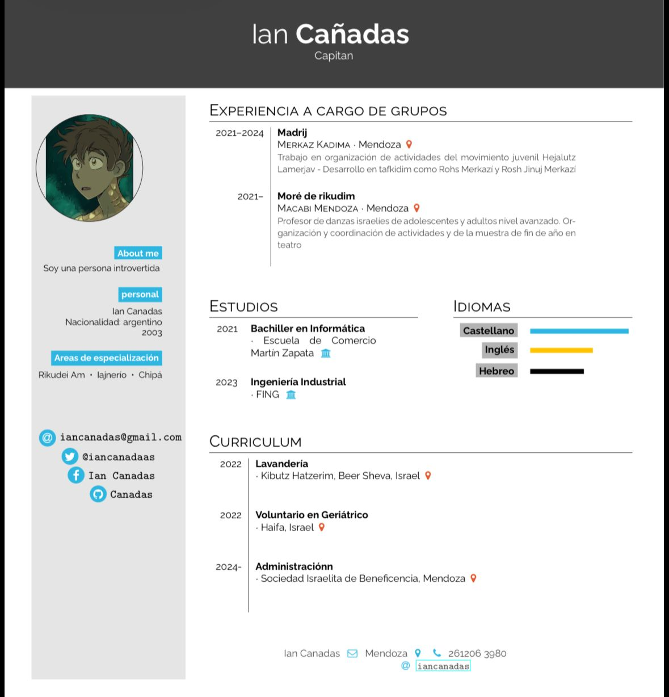
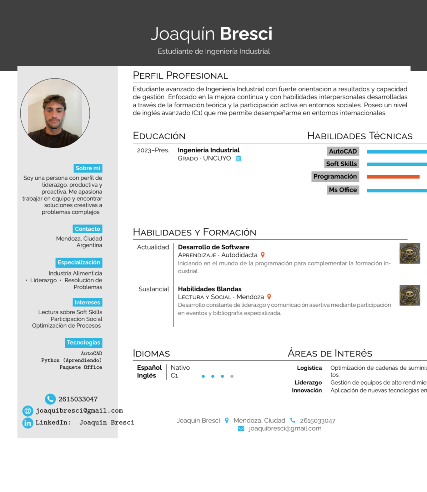

| **11 DE MARZO** CLASE 2 |
| :--- |
 

# ENTREGA MÓDULO 1
**Grupo Pipu's**

  

- Mateo Isgro <https://github.com/MATEO9ISGRO/Modulo1> 2615522919
- Ian Cañadas <https://github.com/IAN3CANADAS/MODULO1> 261206390
- Joaquin Bresci <https://github.com/joacobre-jpg/MODULO1> 2615033047
- Luca Salvo <https://github.com/lucaferrosalvo-star/MODULO1> 2615193142
- Nicolas La Rocca  <https://github.com/nicotox3/nico_larocca>2613629131 
- Bautista Zanetti <https://github.com/zanettibauti-hub/UNIDAD-1>2615085226

*Ejercicio 11 de marzo*

| Nombre | Apellido | Correo | Whatsapp | Github |
|:----------|:----------|:----------|:----------|:------------|
| Joaquin | Bresci | joaquibresci@gmail.com | 2615033047 | <https://github.com/joacobre-jpg/Modulo_1_TyHMI>|
| Bautista  |Zanetti|zanettibauti@gmail.com|2615085226| <https://github.com/zanettibauti-hub/_-modulo_1>|
|Luca|Salvo|lucasalvo@gmail.com|2615193142| <https://github.com//lucaferrosalvo-star/_-modulo_1>|
|Ian|Cañadas|iandcanadas@gmail.com|261206390|<https://github.com/IAN3CANADAS/_-modulo_1>|
|Mateo |Isgro|mateoisgro@gmail.com|2615522919| <https://github.com/MATEO9ISGRO/_-modulo_1>|
|Nicolas|La Rocca|nico.larocca2026@gmail.com|2613629131| <https://github.com/nicotox3/nico_larocca>|

----------------------------------------------------------------------------------------------------------------------------------------

| **18 de Marzo** CLASE 3|
| :--- |

$$e^{i\pi} + 1 = 0$$
LATEX

-NUEVO PROYECTO---OPCION BOOKS SE USA PARA TESIS

-INTRODUCCION--> TEMA DE EJEMPLO "GEMELOS INFORMÁTICOS"

-TITULO

SUBTITULO

SECCION

SUBSECCION

APLICAR ECUACIONES 

APLICAR TABLAS (CON LETRAS GRIEGAS)

SIMBOLOGIA MATEMATICA:MENOR IGUAL,MAYOR O IGUAL,AL CUBO,APROXIMADAMENTRE IGUAL,LIMITE DE A CUANDO X TIENDE A DESIGUAL A INFINITO

APLICAR IMAGEN 

> [!NOTE]
> Archivo subido como .zip para abrir con LATEX y tambien en formato .pdf

➡️  **PARTE 2**

-Curriculum de cada integrante.

1) Curriculum Mateo Isgro:

  

2) Curriculum Ian Cañadas:

  

3) Curriculum Bautista Zanetti:

4) Curriculum Joaquin Bresci:

  

5) Curriculum Nicolás La Rocca:

6)

7)

-USAR PLATILLA Simple Hipster CV

------------------------------------------------------------------------------------------------------------------------------------

| **25 de Marzo** CLASE 4|
| :--- |

➡️  **PARTE 2**

-CV

-USAR PLATILLA Simple Hipster CV
-buscar como incustrar el link en un archivo .txt
-poner el link de cada integrante en el modulo 1 del grupo 

------------------------------------------------------------------------------------------------------------------------------------

| **25 de Marzo** CLASE 4|
| :--- |
**PASOS PARA ENTREGAR EL INFORME DEL MODULO 1**

>-USAR EN OVERLEAF PLANTILLA SLNC
>-INSTITUCION 1 PARA TODOS(UNCUYO)
>-\orcidID DEJAR SOLO LOS CORCHETES PARA TODOS LOS AUTORES
>-EL PRIMER AUTOR QUE SEA EL DUEÑO DEL GITHUN

ver los archivos que sube el grupo:"budin de banana"
INSITUTO DE INGENIERIA INUDSTRIAL 5502

usar ia para hacer un resumen basado en los temas vistos (abtract)

htlm 
markdown 
latex
google colab
git hub
cheat sheet
palabras claves: uncuyo,tyhm,markup language

seccion 2

ejemplo de codigo htlm
pegar un codigo htlm en una parte del overleaf  con distintas partes del de por ejemplo como agregar una tabla en overlef

\begin{lstlisting}
<!DOCTYPE html>
<html>
<body>
  <h1>Mi Título</h1>
  
Hola mundo en HTML.

</body>

REFERENCIAS BIBLIOGRAFICAS
bibliografia.bib
GOGOEL ACADEMICO
BUSCAR UN LIBRO
CITAR
BIBTEX Y COPIAR 

AGREGAR 5 REFERENCIAS DE HTML,GITHUB,LATEX,COLLAB

